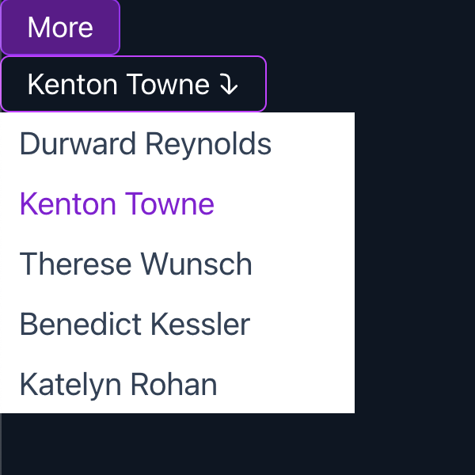

# Headless UI

This repo shows how to use the React [Headless UI](https://headlessui.com/) library.

- Headless UI is A set of completely unstyled, fully accessible UI components, designed to integrate beautifully with Tailwind CSS.

> Note: For more components examples visit the [Headless UI](https://headlessui.com/) website.

## Live Demo

- [https://headless-ui-chi.vercel.app/](https://headless-ui-chi.vercel.app/)

## Getting Started

- clone the repo and cd into the directory
- run `npm install` to install dependencies
- run `npm run dev` to start the development server

## Resources

- [Documentation](https://headlessui.com/)
